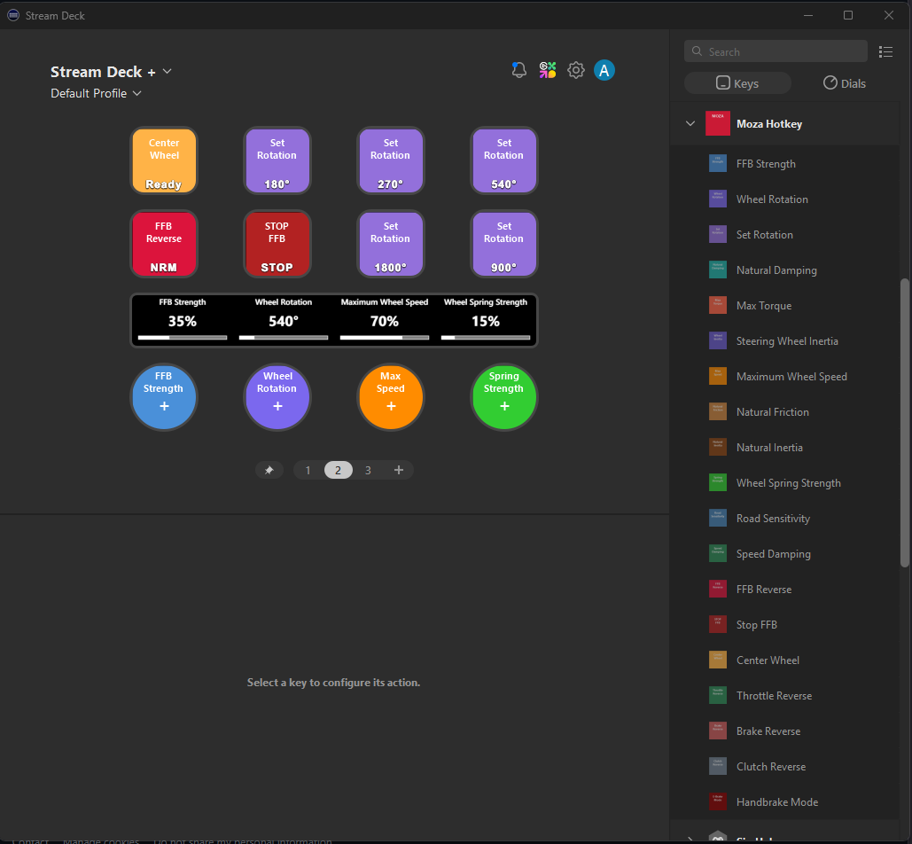

# Moza Stream Deck Plugin

A Stream Deck plugin for controlling Moza Racing wheel bases. Adjust FFB strength, wheel rotation, and other settings directly from your Stream Deck without alt-tabbing out of your sim racing games.



## Quick Start

**[Download from Releases](https://github.com/d-b-c-e/moza-streamdeck-plugin/releases)**

1. Click "Assets" to expand the downloads
2. Download the `.streamDeckPlugin` file
3. Double-click to install
4. Done! Find "Moza Racing" in your Stream Deck actions

*Requires: Windows 10/11, Stream Deck software 6.0+, and Moza Pit House installed*

See what's new in the [Changelog](CHANGELOG.md).

---

## Why I Made This

I created this plugin because as a single monitor user, alt-tabbing in and out of games to Moza Pit House often causes issues for non-borderless windowed games.

I'm also aware there's a mobile app that does much of this, but honestly I dislike all the distractions that come with having my phone out while racing. I just prefer good old fashioned tactile buttons.

Yes I'm also aware Moza Pithouse has some auto-switching profiles now, however it only supports a very small handful of games where I tend to be on the casual side with games unlikely to ever have official support (arcade + simcade).  I like to hop around different games when I play, so I wanted some quick buttons and knobs to adjust particularly FFB Strength and Max Wheel Rotation when I'm hopping between arcade games.  

I thought something like this would already exist but couldn't find anything similar, so I decided to build it myself. Luckily with the advancement of AI coding agents, it took most of the friction out of development and I managed to get the majority of it done in a weekend where it would normally take me weeks to figure all this out on my own.

I hope you find it useful! I might consider deploying it to the Stream Deck Marketplace if feedback is positive and people feel it's mostly feature complete.

## Features

- **Full Stream Deck Support**: Works with Stream Deck buttons and Stream Deck+ dials
- **Real-time Display**: Current values shown on buttons and dial LCD screens
- **Per-Action Settings**: Configure increment values and direction for each button
- **23 Available Actions**: Control all major wheel base, pedal, and shifter settings
- **Apply Preset**: Load Moza Pit House motor presets directly from Stream Deck

## Available Actions

### Adjustable Settings (Button + Dial)

| Setting | Range | Description |
|---------|-------|-------------|
| FFB Strength | 0-100% | Force feedback intensity |
| Wheel Rotation | 90-2700° | Steering lock angle |
| Natural Damping | 0-100% | Simulated steering resistance |
| Max Torque | 50-100% | Maximum torque output limit |
| Steering Wheel Inertia | 100-1550g | Simulated wheel weight |
| Maximum Wheel Speed | 0-100% | Wheel rotation speed limit |
| Natural Friction | 0-100% | Static friction simulation |
| Natural Inertia | 100-500% | Rotational inertia simulation |
| Spring Strength | 0-100% | Center spring force |
| Road Sensitivity | 0-10 | Road feel detail level |
| Speed Damping | 0-100% | Speed-dependent damping to reduce oscillation |
| Auto-Blip Output | 0-100% | Automatic rev-match throttle amount (shifter) |
| Auto-Blip Duration | 0-500ms | Automatic rev-match duration (shifter) |

### Preset & Utility Actions (Button only)

| Action | Description |
|--------|-------------|
| Set Rotation | Set wheel rotation to a specific preset value (180-2520) |
| Center Wheel | Centers the steering wheel |
| FFB Reverse | Toggles force feedback direction |
| Stop FFB | Emergency kill switch - stops all force feedback |
| Throttle Reverse | Toggles throttle pedal output direction |
| Brake Reverse | Toggles brake pedal output direction |
| Clutch Reverse | Toggles clutch pedal output direction |
| Handbrake Mode | Toggles handbrake between axis and button mode |
| Auto-Blip Toggle | Toggles automatic rev-match on downshift (shifter) |
| Apply Preset | Apply a Moza Pit House motor preset to your wheel base |

## Requirements

- Windows 10/11 (x64)
- Elgato Stream Deck software 6.0+
- Moza Pit House installed (required for SDK communication)
- Moza Racing wheel base (R5, R9, R12, R16, R21, etc.)

## Installation

1. Download the latest `.streamDeckPlugin` file from [Releases](https://github.com/d-b-c-e/moza-streamdeck-plugin/releases)
2. Double-click the file to install
3. Stream Deck will open and the plugin will be available under "Moza Racing"

## Uninstallation

1. Close the Stream Deck application
2. Delete the plugin folder:
   ```
   %APPDATA%\Elgato\StreamDeck\Plugins\com.dbce.moza-streamdeck.sdPlugin
   ```
3. Restart Stream Deck

## Usage

### Button Configuration
1. Drag an action to a Stream Deck button
2. Set **Direction**: Increase or Decrease
3. Set **Increment**: Amount to change per press

### Dial Configuration (Stream Deck+)
1. Drag an action to a dial
2. Set **Increment**: Amount to change per rotation tick
3. Rotate clockwise to increase, counter-clockwise to decrease
4. Press the dial to refresh the current value display

### Display
- Buttons show the setting label at top, current value at bottom
- Dials show current value on LCD with an indicator bar
- "N/C" indicates the wheel base is not connected

## Troubleshooting

### Device Not Connected (N/C)
1. Ensure Moza Pit House is installed and can see your wheel base
2. Make sure the wheel base is powered on and connected via USB
3. Try restarting the Stream Deck software
4. Check that no other application is exclusively using the Moza SDK

### Values Not Updating
- The plugin retries connection automatically every second
- Press a dial or interact with a button to force a refresh
- Restart Stream Deck if issues persist

## Building from Source

```bash
# Clone the repository
git clone https://github.com/d-b-c-e/moza-streamdeck-plugin.git
cd moza-streamdeck-plugin

# Build the Stream Deck plugin
.\scripts\build-streamdeck-release.ps1

# Deploy for local testing
.\scripts\deploy-streamdeck.ps1 -KillStreamDeck
```

## License

MIT License - see LICENSE file for details.

## Acknowledgments

- [Moza Racing / Gudsen Technology Co., Ltd](https://mozaracing.com/) for the SDK
- [BarRaider](https://github.com/BarRaider) for StreamDeck-Tools library
- The sim racing community for feedback and testing

## Disclaimer

This project is not affiliated with, endorsed by, or sponsored by Gudsen Technology Co., Ltd (Moza Racing) or Elgato. Use at your own risk.
